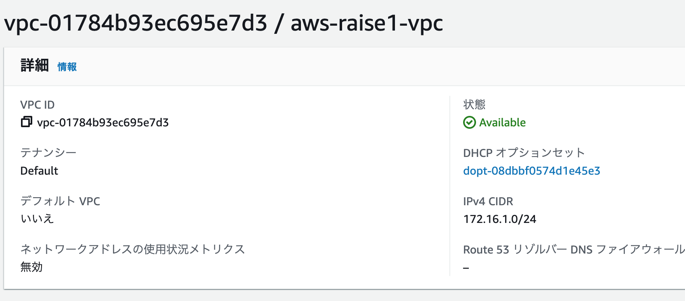
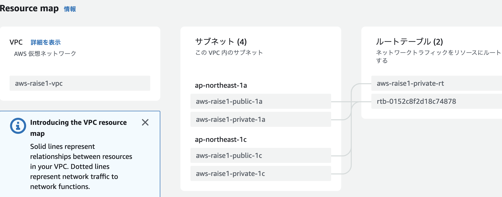
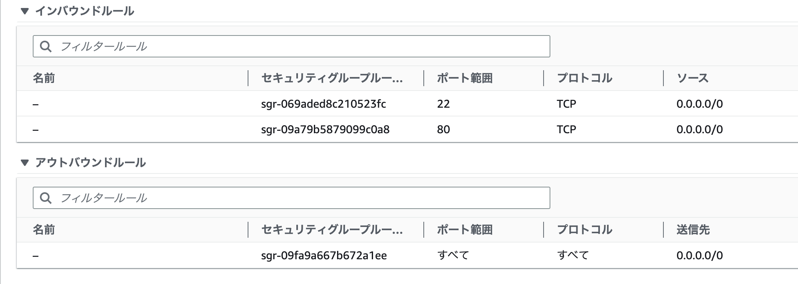
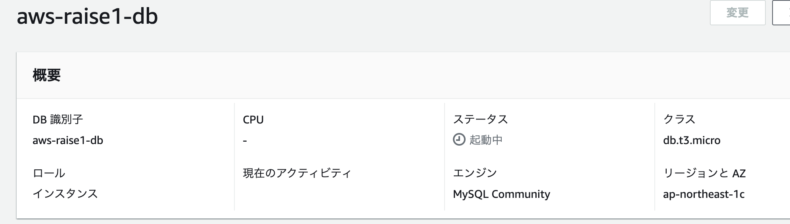
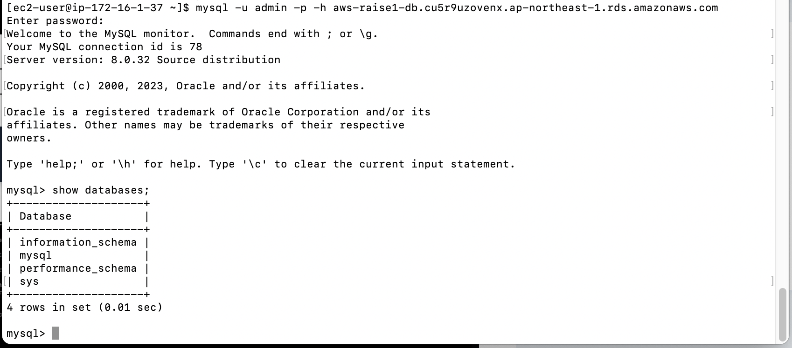

# Lecture04

### VPC設定
----
+ VPC作成  
IPv4 CIDRブロックに使用したいIPアドレスをCIDR表記で記入。
172.16.1.0/24で作成した。



+ サブネット  
パブリックサブネットを1aと1cのAZに作成。同様にプライベートサブネットも1aと1cのAZに作成した。合計４個のサブネットを作成。



+ インターネットゲートウェイ  
作成してVPCにアタッチ


+ ルートテーブル  
パブリックサブネット用に送信先を0.0.0.0/0にし、ターゲットをIGWに設定。プライベートはローカルのみ。


### EC2インスタンス
----
+ OSはAmazon Linux 2023
+ インスタンスタイプはt2.micro
+  パブリックサブネットに作成
+  自動割り当てパブリックIPアドレスを有効
+  SSHとHTTP用のポートを開けたセキュリティグループを使用



+  MySQLインストール
```
$ sudo dnf -y localinstall  https://dev.mysql.com/get/mysql80-community-release-el9-1.noarch.rpm
$ sudo dnf -y install mysql mysql-community-client
$ sudo yum install mysql mysql-devel
```


+ 作成したEC2インスタンス


### RDS
----
+ MySQLエンジンバージョン 8.0.32
+ インスタンスタイプ db.t3.micro
+ セキュリティグループ  
タイプはMySQL/Aurora。
 ソースにEC2インスタンスで使用したSGを使用すれば、インスタンスのIPアドレスが変わってもOK。
 
 
+ サブネットグループ  
無料枠内でもAZが異なる２つ以上のサブネットが必要。
VPCで作成した1aと1cのプライベートサブネットを使用。


+ 作成したRDS DBインスタンス



### EC2とRDSの接続
----

