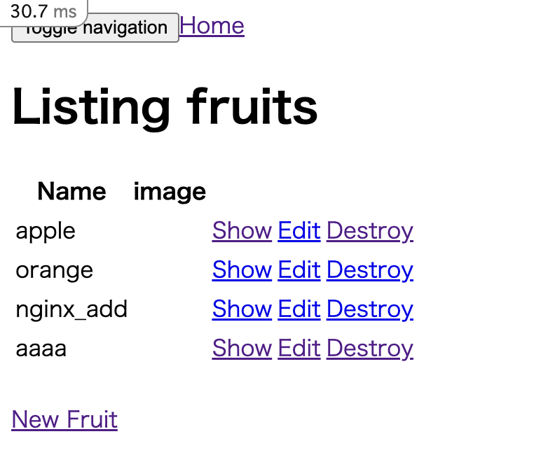
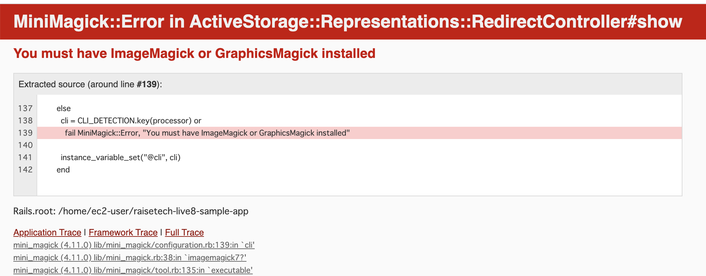
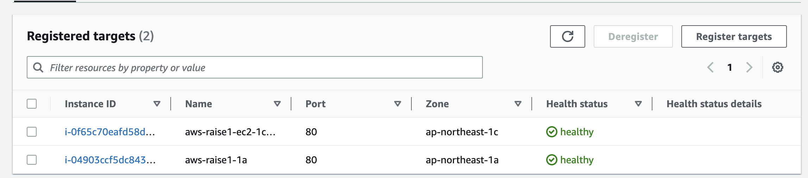
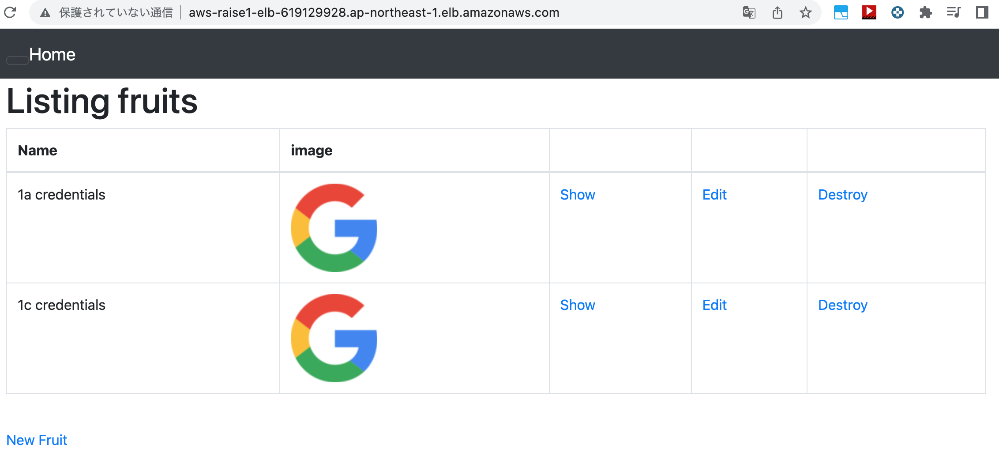
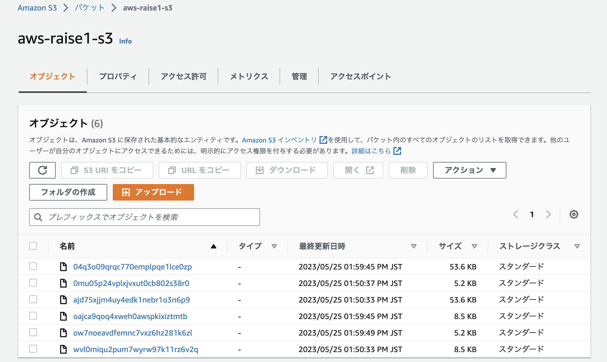

# Lecture05
## アプリケーションのデプロイ


### Ruby 3.1.2インストール
----
git, rbenvをインストール
```
# 必要なパッケージを入れておく
$ sudo yum install -y gcc rust patch make bzip2 openssl-devel libyaml-devel libffi-devel readline-devel zlib-devel gdbm-devel ncurses-devel

$ sudo yum install -y git
$ git clone https://github.com/sstephenson/rbenv.git ~/.rbenv
$ git clone https://github.com/sstephenson/ruby-build.git ~/.rbenv/plugins/ruby-build
```

pathを通す
```
$ echo 'export PATH="$HOME/.rbenv/bin:$PATH"' >> ~/.bash_profile
$ echo 'eval "$(rbenv init -)"' >> ~/.bash_profile
$ source ~/.bash_profile
```

Rubyインストール
```
$ git clone https://github.com/sstephenson/ruby-build.git ~/.rbenv/plugins/ruby-build
$ rbenv install 3.1.2
$ rbenv global 3.1.2
```

### bundle install
---
bundle 2.3.14とyarn 1.22.19インストール
```
#bundlerインストール
$ gem install bundler -v 2.3.14

#　Node.jsインストール
$ curl -o- https://raw.githubusercontent.com/nvm-sh/nvm/v0.39.3/install.sh | bash
$ . ~/.nvm/nvm.sh
$ nvm install 17.9.1
$ nvm use 17.9.1

# yarnインストール
$ npm install -g yarn
$ yarn install
$ yarn -v

# sasscのビルドに必要なパッケージをインストール
$ sudo yum install -y gcc gcc-c++ make

$ bundle install

```

### RDS for MySQL接続
database.yml書き換え
```
default: 
 host: RDSのエンドポイント
 username:　マスターユーザー
 password: マスターパスワード
 port: 3306
```
DB作成
```
$ bundle exec rails db:create
$ bundle exec rails db:migrate
```

### ローカル環境でアプリ起動
`$ bin/dev`実行もエラー
webpackなんてありませんとのエラー
webpack、webpack-cliインストールで解決
```
$ npm install webpack webpack-cli
```
アプリ起動成功
SQLへの書き込みも成功

### NGINX + Pumaでデプロイ
NGINXインストール
```
sudo amazon-linux-extras install nginx1
```

/etc/nginx/conf.d/app.confを作成し、設定を書き込み
/etc/nginx/nginc.confの重複部分をコメントアウト
```
# app.conf
#サーバーグループ「test-app」を定義
upstream test-app{
  #転送先のURLを記載
  server localhost:3000;
}

#仮想サーバの設定
#接続ポート、サーバ名、ドキュメントルート(Railsのアプリフォルダ配下のpublicフォルダ）
server {
  listen 80;
  server_name 18.179.8.173;
  root /home/ec2-user/raisetech-live8-sample-app/public;
# railsアプリの場合Publicフォルダを指定すればOK

  #「/～」以下のリクエストに対する設定
  location / {
    #指定されたパスが存在すれば、そのファイルを応答
    #存在しない場合には、Railsアプリとして@test-appにリダイレクト
    #@test-appの設定は下のlocation @test-appに記載している。
    try_files $uri @test-app;
  }

  #リダイレクト受け付け用の@test-appの設定
  location @test-app {
    #ヘッダー情報を定義
    proxy_set_header X-Forwarded-For $proxy_add_x_forwarded_for;
    proxy_set_header Host $http_host;
    #http://アプリ名　を記載
    proxy_pass http://localhost:3000;
  }

   #エラーページの設定
  error_page 500 502 503 504 /500.html;
}
```
IPアドレス打ち込んでページ表示確認


### NGINX + Unicornでデプロイ
Gemfileで記載済みのためインストール不要
前項で作成したnginxの設定ファイルをunocorn用に書き換え
```
# app.conf
# unicorn用
error_log  /home/ec2-user/raisetech-live8-sample-app/log/nginx.error.log;
access_log /home/ec2-user/raisetech-live8-sample-app/log/nginx.access.log;

upstream unicorn_server {
    server unix:/home/ec2-user/raisetech-live8-sample-app/unicorn.sock fail_timeout=0; #自分のアプリケーション名に変更
}

server {
    listen 80;
    client_max_body_size 4G;
    server_name 54.249.5.181; #アプリのElastic IPに変更

    keepalive_timeout 5;

    # Location of our static files
    root /home/ec2-user/raisetech-live8-sample-app/public; #自分のアプリケーション名に変更

    location ~ ^/assets/ {
        root /home/ec2-user/raisetech-live8-sample-app/public; #自分のアプリケーション名に変更
    }

    location / {
        proxy_set_header X-Forwarded-For $proxy_add_x_forwarded_for;
        proxy_set_header Host $http_host;
        proxy_redirect off;

        if (!-f $request_filename) {
            proxy_pass http://unicorn_server;
            break;
        }
    }

    error_page 500 502 503 504 /500.html;
    location = /500.html {
        root /home/ec2-user/raisetech-live8-sample-app/public; #自分のアプリケーション名に変更
    }
}
```
NGINXとUnicornをスタート
```
$ sudo systemctl start nginx
$ bundle exec uncorn -c config/unicorn.rb -D
```
+ ページにアクセスするも表示されず
nginxのエラーログに以下の記載あり
```
 # nginx.error.log
4467#4467: *46 stat() "/home/ec2-user/raisetech-live8-sample-app/public/500.html" failed (13: Permission denied), client: 139.162.84.205, server: 18.179.8.173, request: "GET / HTTP/1.0", upstream: "http://unix:/home/ec2-user/raisetech-live8-sample-app/unicorn.sock/"
4467#4467: *46 connect() to unix:/home/ec2-user/raisetech-live8-sample-app/unicorn.sock failed (13: Permission denied) while connecting to upstream, client: 139.162.84.205, server: 18.179.8.173, request: "GET / HTTP/1.0", upstream: "http://unix:/home/ec2-user/raisetech-live8-sample-app/unicorn.sock:/500.html"
```
UnicornとNGINXの実行者が同じである必要がある様子
`/etc/nginx/nginx.conf`内のuserをec2-userへ変更
+ ページは表示されたがCSSとJSが効いていない  

nginx.error.logファイルにはapplication.debug-xxxxx.cssや.jsがありませんよというメッセージ
```
# nginx.error.log
2023/05/20 09:13:26 [error] 6329#6329: *14 open() "/home/ec2-user/raisetech-live8-sample-app/public/assets/application.debug-045d6c1e62258d4ae7078d64799062276abf5d227a8851f9495ee72f0681f7ba.css" failed (2: No such file or directory), client: 49.106.187.116, server: 18.179.8.173, request: "GET /assets/application.debug-045d6c1e62258d4ae7078d64799062276abf5d227a8851f9495ee72f0681f7ba.css HTTP/1.1", host: "52.194.188.155", referrer: "http://52.194.188.155/"
2023/05/20 09:13:26 [error] 6329#6329: *13 open() "/home/ec2-user/raisetech-live8-sample-app/public/assets/application.debug-a387179ee297f7a479c31dda4ed622f9d560971b892c1e3e7fa5441fc82bc7e9.js" failed (2: No such file or directory), client: 49.106.187.116, server: 18.179.8.173, request: "GET /assets/application.debug-a387179ee297f7a479c31dda4ed622f9d560971b892c1e3e7fa5441fc82bc7e9.js HTTP/1.1", host: "52.194.188.155", referrer: "http://52.194.188.155/"
```
実際にpublic/assetsには上記のファイルは存在しない  
**development.rbの`config.assets.debug=false`に変更でcss、JS反映OK**  
ブラウザから元のcssファイルなどを辿って検証するために、デバッグファイルを作成して、アクセスするようにする設定のため？

+ アプリにアップロードした画像が表示されない  
アプリページのソースを表示して、画像のURLをクリックすると以下のページが出てきた

ImageMagickをインストールして解決


### ELB追加
---
異なるAZに２つEC2インスタンスを作成した  
ヘルスチェック&AZ確認用にそれぞれのAZを書いたhtmlファイルを作成  
次のディレクトリに配置public/healthcheck/index.htmlを追加   
ターゲットグループに両方のインスタンスを追加  
ヘルスチェック通過を確認

ALBのDNSから1a,1cインスタンス共にアクセス成功  



### S3追加
アップロードした画像保存用に使用
+ IAMユーザー作成  
S3用のIAMユーザーを作成し、AmazonS3FullAccessをアタッチ。  
アクセスキーとシークレットキーをダウンロードを保存しておく。  
パブリックアクセスを全てブロックする設定でS3バケットを作成。  
S3用のIAMユーザーのコンソールアクセスを無効に設定。  

+ aws-sdk-s3インストール  
Gemfileで`gem "aws-sdk-s3", require: false`を確認

+ Active Storageの設定  
config/storage.ymlにamazon S3の記載確認  
config/environment/development.rbの設定を以下に書き換え
```
# :localから：amazonへ
config.active_storage.service = :amazon
```

+ Credentials設定  
`$ EDITOR="vim" rails credentials:edit`でconfig配下に`credentials.yml.enc`と`master.key`を新規作成  
credentials.yml.encを編集
```
　# credentials.yml.enc

aws:
   access_key_id: 'IAMアクセスキー'
   secret_access_key: 'IAMシークレットアクセスキー'
```

+ アプリからS3にアップロードされたファイルを確認



## 構成図
.png)