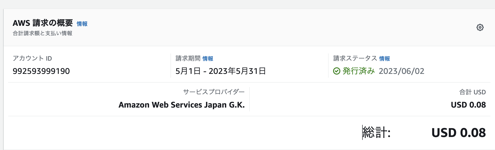
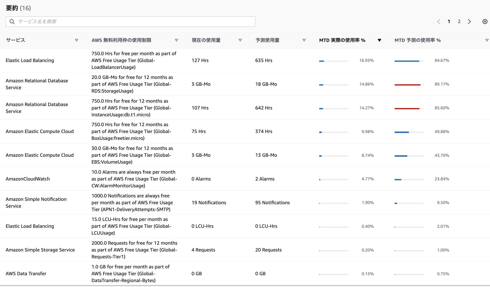

# Lecture 06
### CloudTrail　イベント履歴
---
+ イベント名：CreateLoadBalancer
+ イベントソース：[elasticloadbalancing.amazonaws.com](http://elasticloadbalancing.amazonaws.com/)
+ “useridentity” :操作したユーザーアカウントおよび日時が記載されている
+ "requestParameters”：作成したLBの種類（ALB）、SG、指定サブネット、LBの名前、スキーム（Internet）といったALBを作成するときに設定した項目が記載されている。
+ "responseElements"：作成されたALBのDNS、ARN、ターゲットが記されている

+ EC2を停止させると、データが取得できなくなりデータ不足になった。  
欠落データの処理の設定で「欠落データを見つかりませんとして処理」としていたため、「欠落データを不正」と変更してアラーム状態になったことを確認。
+ nginxを落とすとヘルスチェックファイルへアクセスできなくなるためメールが発報される
+ unicornだけを落とした状態ならヘルスチェックが通るため、メールが発報されない
 + railsアプリだけが動いていない場合のヘルスチェック  
 ELBのヘルスチェック先をただのhtmlにするとWebサーバーが動いていれば通ってしまうため、Unhealtyになるようヘルスチェック用のアクションを追加した
 ```
 # コントローラー’elb’とアクション’health’を作成
 $ bin/rails g controller elb health
 ```
 ルートとアクションを設定
 ```
 # app/controllers/elb_controller.rb
class ElbController < ApplicationController
  def health
    render json:{result: 'AZ 1a'}
  end
end
```
```
# config/routes.rb
get '/healthcheck' => 'elb#health'
```
unicornだけが落ちててもヘルスチェックが通らないようになった


### CloudWatchアラーム
---
+ アラーム状態のアラームを設定してEC2を落とすとメール発報
```
Alarm Details:
- Name:                       test2-alarm-1a
- Description:                1a alarm test
- State Change:               OK -> ALARM
- Reason for State Change:    Threshold Crossed: 2 out of the last 2 datapoints [1.0 (02/06/23 12:21:00), 1.0 (02/06/23 12:20:00)] were greater than or equal to the threshold (1.0) (minimum 2 datapoints for OK -> ALARM transition).
- Timestamp:                  Friday 02 June, 2023 12:23:57 UTC
```


+ OKアラームを設定   
アプリが復帰したタイミングでメール発報も確認
```
Alarm Details:
- Name:                       oktest
- Description:                healtyになったら発報される
- State Change:               ALARM -> OK
- Reason for State Change:    Threshold Crossed: 1 out of the last 2 datapoints [0.0 (02/06/23 12:28:00)] was not greater than or equal to the threshold (1.0) (minimum 1 datapoint for ALARM -> OK transition).
- Timestamp:                  Friday 02 June, 2023 12:30:35 UTC
```


### AWS利用料
---
+ 見積もり  
https://calculator.aws/#/estimate?sc_channel=cfm-blog&sc_campaign=la-get-cost-estimates-faster-with-aws-pricing-calculator-bulk-import&sc_medium=plan-and-evaluate&sc_content=cfm-blog&sc_detail=link&sc_outcome=ad&sc_publisher=cfm-adoption&trk=la-get-cost-estimates-faster-with-aws-pricing-calculator-bulk-import_cfm-blog_link&id=4bd10d92712b362c0837cf3b85b0f6e54c5f3fe9


+ 利用料の確認  
試しで有料のインスタンスタイプを作成したため、5月分は$0.08だった  
  

+ 無料利用枠  
6月始まったばかりなのでまだ無料枠だが、EC2/RDSを立ち上げたままだとオーバー  
ELBが伏兵だった。停止できないので複数作成すると無料枠が超えてしまう。長い間使わないものは削除して、使用時に再作成したほうがいい。
