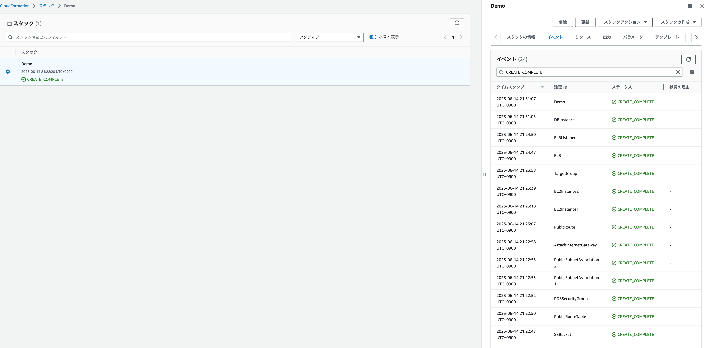

# Lecture 10

1. [CloudFormation](#1-cloudformation)
2. [Parameters](#2-parameters)
3. [VPC](#3-vpc)
4. [EC2](#4-ec2)
5. [RDS](#5-rds)
6. [ELB](#6-elb)
7. [S3](#7-s3)
8. [Stack生成](#8-stack生成)
9. [SecretsManagerに保管したDBパスワードの管理](#9-secretsmanagerに保管したdbパスワードの管理)
10. [感想](#10-感想)

## 1. CloudFormation
---
CloudFormationとはAWSでIaCを行うためのサービス。  
TemplateというYAML形式で記述されたファイルをCloudFormationに読み込ませると、Stackという複数のリソースを管理するものが生成される。  
  
Stack配下のリソースに変更が加えられた場合、ドリフト検出機能を使用して変更された箇所を簡単に確認できる。  
また、テンプレート自体を変更してリソースに変更を加えることも可能。（パラメーターによってはリソースが破棄される可能性がある）  
  
Templateも再利用できるようになっている。Parameters機能を使えば、よく使う値を変数のように扱うことができ、Stack作成時に値を振り直してあげることが可能。  
  
作成したStackから値を拾って別のStackに使用することも可能。Template内のOutputsを使用して出力、ImportValueで引用できる。  
  
Stackを削除すると関連するリソースが全て削除される。  
  
Stackを作成する際はレイヤー、ライフサイクルや重要度に合わせてスタックを分割するように考える必要がある。（課題終わってから気づいた）  


メリット：
- 構築作業を効率化、再現性が高い
- バージョンやリソースの管理をしやすい
- オペレーションミスを減らせる  

デメリット：
- 手動の方が早い場合もある  


## 2. Parameters
---
テンプレート内でよく使うパラメータや変更したいものを定義づけしておく。
- Ec2ImageId：リージョンで変わるAMIの値をリストから引っ張ってきてくれる。

```
AWSTemplateFormatVersion: "2010-09-09"
Description: 'raisetech demo by CloudFormation'

#--------------
# Parameters
#--------------

Parameters: 
  Namebase:
    Description: base name
    Type: String
    Default: raisetech-demo

Ec2ImageId:
    Type: AWS::SSM::Parameter::Value<String>
    Default: /aws/service/ami-amazon-linux-latest/amzn2-ami-hvm-x86_64-gp2
```


## 3. VPC
---
VPCに関するリソースを記入していく

VPC、サブネット、IGW、ルーティングを設定する

- VPC

```yaml
#--------------
# VPC
#--------------
Resources:
  MyVPC:
    Type: AWS::EC2::VPC
    Properties:
      CidrBlock: 172.16.1.0/24
      Tags:
        - Key: Name
          Value: !Sub VPC-${Namebase}
        - Key: Raise
          Value: !Sub VPC-${Namebase}
```

- Subnet

Public ×2、Private ×2を作成

VpcIdでVPCを指定

MappublicOnLaunchはサブネットにGIPを付与するかの設定。デフォルトはfalse。

AvailabilityZone: `!Select`はインデックスリストから値を返す組込み関数。
リストは作成することも可能。
AZの場合、`Fn::GetAZs`を使用することが多い。
`AWS::Region`はスタックがデプロイされるリージョンを返してくれる。
`!Ref`を使用して`Fn::GetAZs`に読み込ませている。

```yaml

# Subnet------
  PublicSubnet1:
    Type: AWS::EC2::Subnet
    Properties:
      VpcId: !Ref MyVPC
      CidrBlock: 172.16.1.0/26
      MapPublicIpOnLaunch: false
      AvailabilityZone: !Select 
        - 0
        - Fn::GetAZs: !Ref AWS::Region
      Tags:
        - Key: Name
          Value: !Sub PublicSubnet-1a-${Namebase}

  PublicSubnet2:
    Type: AWS::EC2::Subnet
    Properties:
      VpcId: !Ref MyVPC
      CidrBlock: 172.16.1.64/26
      MapPublicIpOnLaunch: false
      AvailabilityZone: !Select 
        - 1
        - Fn::GetAZs: !Ref AWS::Region
      
      Tags:
        - Key: Name
          Value: !Sub PublicSubnet2-${Namebase}
        
  
  PrivateSubnet1:
    Type: AWS::EC2::Subnet
    Properties:
      VpcId: !Ref MyVPC
      CidrBlock: 172.16.1.128/26
      AvailabilityZone: !Select 
        - 0
        - Fn::GetAZs: !Ref AWS::Region
      Tags:
        - Key: Name
          Value: !Sub PrivateSubnet1-${Namebase}

  PrivateSubnet2:
    Type: AWS::EC2::Subnet
    Properties:
      VpcId: !Ref MyVPC
      CidrBlock: 172.16.1.192/26
      AvailabilityZone: !Select 
        - 1
        - Fn::GetAZs: !Ref AWS::Region
      Tags:
        - Key: Name
          Value: !Sub PrivateSubnet2-${Namebase}
```

- Internet Gateway

IGWはリソースタイプで定義するだけ。
作成したらVPCにアタッチ。

`!Ref`を使用してアタッチするVPCとIGWを指定する。

```yaml
# Internet Gateway -------
  InternetGateway:
    Type: AWS::EC2::InternetGateway
    Properties:
      Tags:
        - Key: Name
          Value: !Sub InternetGateway-${Namebase}
  
  AttachInternetGateway:
    Type: AWS::EC2::VPCGatewayAttachment
    Properties:
      InternetGatewayId : !Ref InternetGateway
      VpcId: !Ref MyVPC
```

- Routing

まずはルートテーブルを作成。

次にルートを定義する。パブリックはインターネットに出ていくために`DestinationCidrBlock`で0.0.0.0を指定し、宛先としてIGWを指定する。プライベート間の指定は不要。

最後にサブネットと紐付ける。紐付けは一つの定義ではできないので、複数ある場合は複数個作成する必要あり。
紐付けしなかったサブネットは自動でメインルートテーブルが作成され、ローカルだけ通信可能。
```yaml
# Route Table ------
  PublicRouteTable:
    Type: AWS::EC2::RouteTable
    Properties:
      VpcId: !Ref MyVPC
      Tags:
        - Key: Name
          Value: !Sub PublicRT-${Namebase}

  PublcRoute:
    Type: AWS::EC2::Route
    Properties:
      RouteTableId: !Ref PublicRouteTable
      DestinationCidrBlock: 0.0.0.0/0
      GatewayId: !Ref InternetGateway

  PublicSubnetAssociation1:
    Type: AWS::EC2::SubnetRouteTableAssociation
    Properties:
      SubnetId: !Ref PublicSubnet1
      RouteTableId: !Ref PublicRouteTable

  PublicSubnetAssociation2:
    Type: AWS::EC2::SubnetRouteTableAssociation
    Properties:
      SubnetId: !Ref PublicSubnet2
      RouteTableId: !Ref PublicRouteTable
```

## 4. EC2
---
- キーペア
SSH用に作成。
デフォルトはRSAタイプ。ED25519に変更したい場合は指定必要。
作成されたキーペアはSSMのパラメータストアに保管されており、値はパラメータストアから確認可能。
```yaml
# Key Pair ------
  KeyPair:
    Type: AWS::EC2::KeyPair
    Properties:
      KeyName: KeyPair20230612
```

- セキュリティグループ
EC2用のSGを作成。SSHとHTTPを開放。

```yaml
# Security Group --------------------------------------------
  EC2SecurityGroup:
    Type: AWS::EC2::SecurityGroup
    Properties:
      GroupName: !Sub EC2-SG-${Namebase}
      GroupDescription: "Security Group for EC2"
      VpcId: !Ref MyVPC
      SecurityGroupIngress:
        - IpProtocol: tcp
          FromPort: 22
          ToPort: 22
          CidrIp: 0.0.0.0/0
        - IpProtocol: tcp
          FromPort: 80
          ToPort: 80
          CidrIp: 0.0.0.0/0
      Tags:
        - Key: Name
          Value: !Sub EC2-SG-${Namebase}
```

- EC2インスタンス

DisableApiTermination：Trueにするとコンソールから削除できなくする。デフォルトはFalse。

ImageId：AMIのIDを指定

Monitoring：詳細なモニタリングを有効にするか

NetworkInterfaces：パブリックIPを有効にする設定。DeviceIndexはENIを付与する順番？
サブネットとSGはこの設定のなかに記述する。

BlockDeviceMapping：EBSの設定。DeleteOnTerminationのデフォルトはTrue。

UserData：インスタンスを立ち上げた後に一回だけ実行されるスクリプト。
```yaml
# Instance -------------------------------------------------
  EC2Instance1:
    Type: AWS::EC2::Instance
    Properties:
      KeyName: !Ref KeyPair
      DisableApiTermination: false
      ImageId: !Ref Ec2ImageId
      InstanceType: t2.micro
      Monitoring: false
      NetworkInterfaces:
        - DeviceIndex: "0"
          SubnetId: !Ref PublicSubnet1
          AssociatePublicIpAddress: true
          GroupSet:
               - !Ref EC2SecurityGroup
      BlockDeviceMappings:
           - DeviceName: /dev/xvda
             Ebs:
              VolumeSize: 8
              VolumeType: gp2
              DeleteOnTermination: true
      UserData: !Base64 |
        #!/bin/bash -ex
        yum update -y
        yum install -y git
		amazon-linux-extras install -y nginx1
		systemctl start nginx
      Tags:
        - Key: Name
          Value: !Sub EC2Instance1-${Namebase}
        - Key: Raise
          Value: !Sub EC2Instance1-${Namebase}
      
  EC2Instance2:
    Type: AWS::EC2::Instance
    Properties:
      KeyName: !Ref KeyPair
      DisableApiTermination: false
      ImageId: !Ref Ec2ImageId
      InstanceType: t2.micro
      Monitoring: false
      NetworkInterfaces:
        - DeviceIndex: "0"
          SubnetId: !Ref PublicSubnet2
          AssociatePublicIpAddress: true
          GroupSet:
               - !Ref EC2SecurityGroup
      BlockDeviceMappings:
           - DeviceName: /dev/xvda
             Ebs:
              VolumeSize: 8
              VolumeType: gp2
              DeleteOnTermination: true
      UserData: !Base64 |
        #!/bin/bash -ex
        yum update -y
        yum install -y git
		amazon-linux-extras install -y nginx1
		systemctl start nginx
      Tags:
        - Key: Name
          Value: !Sub EC2Instance2-${Namebase}
        - Key: Raise
          Value: !Sub EC2Instance2-${Namebase}
```

## 5. RDS
---
- RDSセキュリティグループ  
EC2に設定したSGをソースに指定
```yaml
RDSSecurityGroup:
    Type: AWS::EC2::SecurityGroup
    Properties:
      GroupName: !Sub RDS-SG-${Namebase}
      GroupDescription: "Security Group for RDS"
      VpcId: !Ref MyVPC
      SecurityGroupIngress:
        - IpProtocol: tcp
          FromPort: 3306
          ToPort: 3306
          SourceSecurityGroupId: !Ref EC2SecurityGroup
      Tags:
        - Key: Name
          Value: !Sub RDS-SG-${Namebase}
```

- RDSサブネットグループ
```yaml
# RDS Subnet Group ---------------------------------------
  RDSSubnetGroup:
    Type: AWS::RDS::DBSubnetGroup
    Properties: 
      DBSubnetGroupDescription: RDS Subnet Group
      SubnetIds:  
        - !Ref PrivateSubnet1
        - !Ref PrivateSubnet2
      DBSubnetGroupName: RDSSubnetGroup
      Tags: 
        - Key: Name
          Value: !Sub RDS-SubnetGroup-${Namebase}
```

- DB Incetance

|           項目           |       説明     |
|         ---             |    ---         |
| AllocatedStorage:20     | ストレージサイズ |
| MaxAllocatedStorage: 20 | オートスケーリングで最大拡張できるストレージサイズ。ただ、オートスケーリングが無効化する訳ではないため、CLIかコンソールで設定を変更する必要がある。 |
| BackupRetentionPeriod: 7 | バックアップの保存期間 |
| DBInstanceIdentifier    | DBインスタンスの固有の識別子 |
| VPCSecurityGroups       | DBに当てるSG。DBSecurityGroupはEC2-Classic専用とのこと。 |
| PreferredBackupWindow   | バックアップの時間帯（UTC)の指定 |
| StorageEncrypted        | ストレージの暗号化の有効化 |
| ManageMasterUserPassword | Secret ManagerにDBパスを保存する。設定するとデフォルトのPW7日ローテが開始される。 |

```yaml
RdsDBInstance:
    Type: AWS::RDS::DBInstance
    Properties:
      AllocatedStorage: 20
			MaxAllocatedStorage: 0
      DBInstanceClass: db.t3.micro
      AllowMajorVersionUpgrade: false
      AutoMinorVersionUpgrade: true
      AvailabilityZone: !Select
        - 0
        - Fn::GetAZs: !Ref AWS::Region
      BackupRetentionPeriod: 7
      DBInstanceIdentifier: !Sub DB-${Namebase}
      DBName: demo1
      DBSecurityGroups: 
        - !Ref RDSSecurityGroup
      DBSubnetGroupName: !Ref RDSSubnetGroup
      Engine: mysql
      EngineVersion: 8.0.32
      MasterUsername: admin
      ManageMasterUserPassword: password
      MultiAZ: false
      PreferredBackupWindow: 18:00-21:00
      PubliclyAccessible: false
      StorageEncrypted: true
      StorageType: gp2
      Tags:
        - Key: Name
          Value: !Sub RDS-${Namebase}
        - Key: Raise
          Value: !Sub RDS-${Namebase}
```

## 6. ELB
---
- ELBセキュリティグループ作成

```yaml
# ELB Security Group -------------------------------------
  ELBSecurityGroup:
    Type: AWS::EC2::SecurityGroup
    Properties:
      GroupName: !Sub ELB-SG-${Namebase}
      GroupDescription: "Security Group for ELB"
      VpcId: !Ref MyVPC
      SecurityGroupIngress:
        - IpProtocol: tcp
          FromPort: 80
          ToPort: 80
          CidrIp: 0.0.0.0/0
      Tags:
        - Key: Name
          Value: !Sub RDS-SG-${Namebase}
```

- Target Group

| 項目                                    | 説明                        |
| ---                                    | ---                         |
| Matcher                                | ステータスコードの設定。HTTPステータスコードの200番台はリクエストが正常に処理されたことを示す。 |
| TargetGroupAttributes                  | ターゲット属性の設定           |
| - deregistration_delay.timeout_seconds | ターゲットが登録解除（オフラインなど）された後、リクエストの転送停止までの時間設定。一時的なオフラインであればリクエストを送り続ける。 |
| スティッキーセッション                     | セッションが切れるまでは同じクライアントからのアクセスは同じサーバーへ誘導する機能 |

```yaml
# Target Group -------------------------------------------
  TargetGroup:
    Type: AWS::ElasticLoadBalancingV2::TargetGroup
    Properties: 
      HealthCheckEnabled: true
      HealthCheckIntervalSeconds: 30
      HealthCheckPath: /
      HealthCheckPort: traffic-port
      HealthCheckProtocol: HTTP
      HealthCheckTimeoutSeconds: 6
      HealthyThresholdCount: 5
      IpAddressType: ipv4
      Matcher: 
        HttpCode: 200-299
      Name: !Sub ALB-TG-${Namebase}
      Port: 80
      Protocol: HTTP
      ProtocolVersion: HTTP1
      Tags: 
        - Key: Name
          Value: !Sub ALB-TG-${Namebase}
        - Key: Raise
          Value: !Sub ALB-TG-${Namebase}
      TargetGroupAttributes: 
        - Key: deregistration_delay.timeout_seconds
          Value: 300
        - Key: stickiness.enabled
          Value: false
#        - Key: stickiness.type
#          Value: load_balancer
#        - Key: stickiness.lb_cookie.duration_seconds
#          Value: 3600
      Targets: 
        - Id: !Ref EC2Instance1
          Port: 80
        - Id: !Ref EC2Instance2
          Port: 80
      TargetType: incetance
      UnhealthyThresholdCount: 2
      VpcId: !Ref MyVPC
```

- Listener

DefaultAction：LBで受け取ったトラフィックの処理設定。以下はTGへ転送の設定。

```yaml
# Listener ------------------------------------------------
  ELBListener:
    Type: AWS::ElasticLoadBalancingV2::Listener
    Properties: 
      DefaultActions: 
        - Type: forward
          TargetGroupArn: !Ref TargetGroup 
      LoadBalancerArn: !Ref ELB
      Port: 80
      Protocol: HTTP
```

- ALB

AWS::ElasticLoadBalancing::XXXはCLB用、AWS::ElasticLoadBalancingV2::XXXはそれ以外。

Scheme：インターネットorローカルの設定

SubnetMapping：固定IPを使用する際はこちらを使う

```yaml
# Elastic Load Balancer -----------------------------------
  ELB:
    Type: AWS::ElasticLoadBalancingV2::LoadBalancer
    Properties: 
      IpAddressType: ipv4
# 属性設定     LoadBalancerAttributes:
      Name: !Sub ELB-${Namebase}
      Scheme: internet-facing
      SecurityGroups: 
        - !Ref ELBSecurityGroup
# for EIP      SubnetMappings: 
      Subnets: 
        - !Ref PublicSubnet1
        - !Ref PublicSubnet2
      Tags: 
        - Key: Name
          Value: !Sub ALB-${Namebase}
        - Key: Raise
          Value: !Sub ALB-${Namebase}
      Type: application
```

## 7. S3
---
| 項目                            | 説明                                           |
| ---                            | ---                                           |
| AccessControl                  | ACLの設定。デフォルトはPrivate。                  |
| PublicAccessBlockConfiguration | パブリックアクセスの設定。デフォルトはtrueで全て拒否。 |
| BucketEncryption               | バケットの暗号化設定。                             |

```yaml
#---------------------------------------------------------
# S3
#---------------------------------------------------------
  S3Bucket:
    Type: AWS::S3::Bucket
    Properties:
      BucketName: !Sub S3-Bucket-${Namebase}
      AccessControl: Private
      PublicAccessBlockConfiguration:
        BlockPublicAcls: True
        BlockPublicPolicy: True
        IgnorePublicAcls: True
        RestrictPublicBuckets: True
      BucketEncryption:
        ServerSideEncryptionConfiguration:
          - ServerSideEncryptionByDefault:
              SSEAlgorithm: AES256
```

## 8. Stack生成
---
Stack生成成功。


## 9. SecretsManagerに保管したDBパスワードの管理
---


## 10. 感想
---
全てのリソースを一つのテンプレートで作成してしまった。次回は構成を意識する。
一つのリソースで設定できる項目が多く、一つ一つの説明を理解するのに苦労した。

